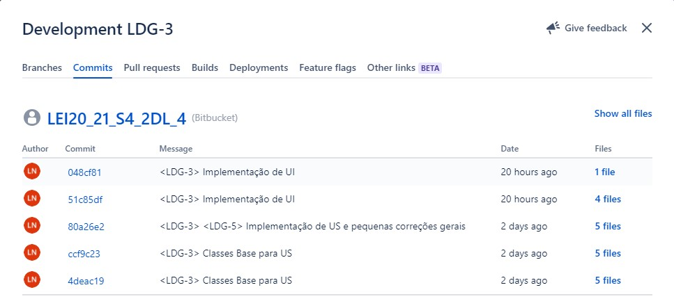

Criar um novo catálogo de serviços.
=======================================

# 1. Requesitos

**US 2001** Como Gestor de Serviços de Help desk (GSH), eu pretendo criar um novo catálogo de serviços.

A interpretação feita neste requesito foi no sentido de criar um novo catálogo de serviços sendo constituído por 
diversos parâmetros (Titulo, Descrição breve, Descrição Completa, Icon, Colaborador Responsável, Equipa).

# 2. Análise 

- A criação de um catálogo serve para disponibilizar aos colaboradores serviços que se encontram 
organizados em catálogos de serviços.
  
- Um catálogo deve disponibilizar um ou mais serviços e possui pelo menos um colaborador que é 
  responsável pela prestação desses serviços.
  
- Em casos mais complexos, um catálogo pode disponibilizar outros catálogos, que por sua vez, disponibilizam outros
catálogos e assim sucessivamente até que os últimos catálogos disponibilizam serviços.
  
# 3. Design

## 3.1. Realização da Funcionalidade

## Diagrama de Sequência

## 3.2 Diagrama de Classes

## 3.3. Padrões Aplicados

* DDD - Domain Driven Design.
  >A elaboração do projeto começou logo com DDD em mente. O modelo de domínio foi elaborado com as regras de negócio e o overlay do DDD para representação de agregados, entities e roots seguindo as regras necessárias.

* GRASP
  >Com cada representação de um ator ou user story, o GRASP era sempre tido em consideração, visto ser uma base fundamental para o bom desenvolvimento do projeto.
  > Quer seja o Information Expert, Low coupling/High cohesion ou o conceito de controller, todos estes princípios estão bastante presentes na mente dos elementos do grupo.

* SOLID
  > O SOLID esteve present principalmente com o Single Responsability Principle, sendo que foi sempre tido em atenção as responsabilidades que uma classe deve ter.
  >Já implementado com o projeto base de EAPLI, a Interface Seggregation Principle veio-se provar útil e esclarecedora, tendo em conta os diversos repositórios que tiveram que ser criados.

## 3.4. Testes 

public static Catalogo dummyCatalogo() {

        final CatalogoBuilder catalogoBuilder = new CatalogoBuilder();
        return catalogoBuilder.comTitulo("teste").comDescBreve("teste").comDescComp("teste").build();
    }

    private Catalogo getNewDummyCatalogo() {
        return dummyCatalogo();
    }

    public void testMesmoCatalogo() {
        Catalogo catalogo = getNewDummyCatalogo();

        final boolean expected = catalogo.equals(catalogo);

        assertTrue(expected);
    }

    public void testObjetoDiferenteCatalogo() {

        Catalogo catalogo = new CatalogoBuilder().comTitulo("sou eu").comDescBreve("teste").comDescComp("teste").build();

        final boolean expected = catalogo.equals(dummyCatalogo());

        assertFalse(expected);
    }

# 4. Implementação

    /**
     * Repositório do Catalogo
     */
    private final CatalogoRepositorio repoCat = PersistenceContext.repositories().catalogoRepositorio();

    /**
     * Especificação de um novo Catalogo
     */
    public Catalogo especificarCatalogo(String titulo, String descBreve, String descCompleta,
                                        int icon, Colaborador colaborador, Set<Equipa> equipaSet) {

        CatalogoBuilder catalogoBuilder = new CatalogoBuilder();
        catalogoBuilder.comTitulo(titulo).comDescBreve(descBreve).comDescComp(descCompleta)
                .comIcon(new byte[icon]).comColaboradorResponsavel(colaborador).comListaEquipas(equipaSet);

        return this.repoCat.save(catalogoBuilder.build());
    }

## 4.1 Commits relevantes

