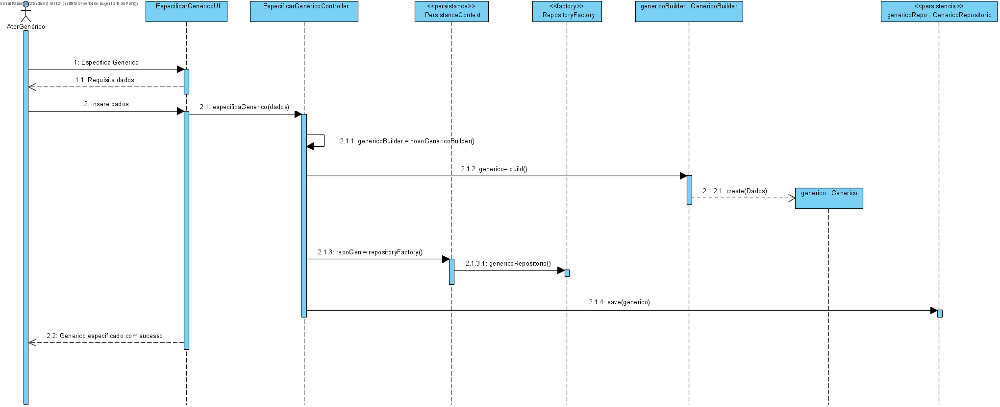

 Especificar Novo Tipo de Equipa
=======================================

# 1. Requisitos

**US 2054** Como RRH, eu pretendo registar um novo tipo de equipa.

A interpretação feita deste requisito consistiu na perceção da necessidade existente da uma melhor organização dentro do sistema. Assim, estando as equipas divididas por Tipos, existe um contexto pálpavel de permissões e assignações de tarefas. 
# 2. Análise

- A especificação de um Tipo de Equipa consiste na contextualização da sua Cor e uma pequena descrição.
- Cor - Cor única da equipa, para melhor identificação no sistema.
- Descrição - Uma pequena descrição para melhor explicar o objetivo e propósito das equipas associadas a este tipo de equipa.

# 3. Design

## 3.1. Realização da Funcionalidade

A implementação da funcionalidade em causa consiste na inserção simples dos dados requeridos na consola, o seu sucesso significa que o Tipo de Equipa ficou registado na base de dados.

## Diagrama de Sequência ##

Foi criado um SD genérico para representar aqueles que o grupo considerava USs de criação simples, e que não justificavam a criação diferenciada de diagramas sendo que eram bastante similares.

O RRH inicia uma nova especificação de um tipo de equipa, o sistema requisita os dados necessários (cor e descrição) e procede à sua criação. Após criação do Tipo de Equipa na unidade de persistência, o RRH é informado da sua criação.

## 3.2. Diagrama de Classes

Foi criado um CD genérico para representar aqueles que o grupo considerava USs de criação simples, e que não justificavam a criação diferenciada de diagramas sendo que eram bastante similares.

## 3.3. Padrões Aplicados

* DDD - Domain Driven Design. 
    >A elaboração do projeto começou logo com DDD em mente. O modelo de domínio foi elaborado com as regras de negócio e o overlay do DDD para representação de agregados, entities e roots seguindo as regras necessárias.

* GRASP
  >Com cada representação de um ator ou user story, o GRASP era sempre tido em consideração, visto ser uma base fundamental para o bom desenvolvimento do projeto.
  > Quer seja o Information Expert, Low coupling/High cohesion ou o conceito de controller, todos estes princípios estão bastante presentes na mente dos elementos do grupo.
  
* SOLID
    > O SOLID esteve present principalmente com o Single Responsability Principle, sendo que foi sempre tido em atenção as responsabilidades que uma classe deve ter.
    >Já implementado com o projeto base de EAPLI, a Interface Seggregation Principle veio-se provar útil e esclarecedora, tendo em conta os diversos repositórios que tiveram que ser criados.
## 3.4. Testes 
*Nesta secção deve sistematizar como os testes foram concebidos para permitir uma correta aferição da satisfação dos requisitos.*

**Teste 1:** Verificar que não é possível criar uma instância da classe Exemplo com valores nulos.

	@Test(expected = IllegalArgumentException.class)
		public void ensureNullIsNotAllowed() {
		Exemplo instance = new Exemplo(null, null);
	}

# 4. Implementação

* LDG-12 Implementação de TipoEquipaBuilder, juntamente com fixes nas restantes classes e aprimoramento do RegistarTipoEquipaController

* LDG-12 Instanciação de método equals 

* LDG-12 Redefinição da Classe Cor em TipoEquipa * * Adicionado value-object e TipoEquipa colocado no persistence.xml

#####Exemplos de commits dados ao longo do desenvolvimento da US
# 5. Integração/Demonstração

* A integração da funcionalidade com o sistema foi bastante facilitada pelo projeto base de EAPLI, visto que, após ter uma boa compreensão de como este funciona, um membro da equipa consegue levar a cabo a criação de uma entidade com os seus respetivos atributos fácil e rapidamente. 
Quer seja com a persistência na base de dados ou a facilidade de observar as diversas camadas de negócio divididas por módulos.
# 6. Observações

* Para próximos Sprints melhorar o tratamento de dados e colocar mais restrições.