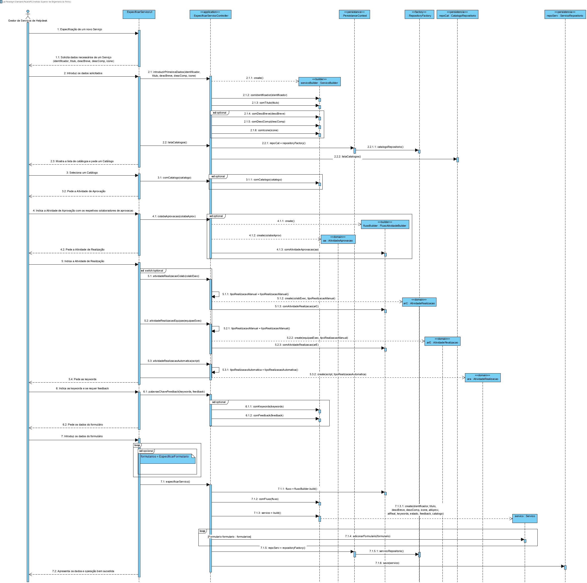
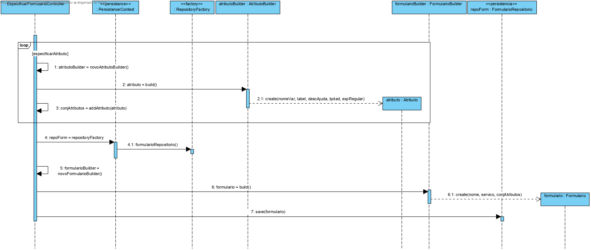
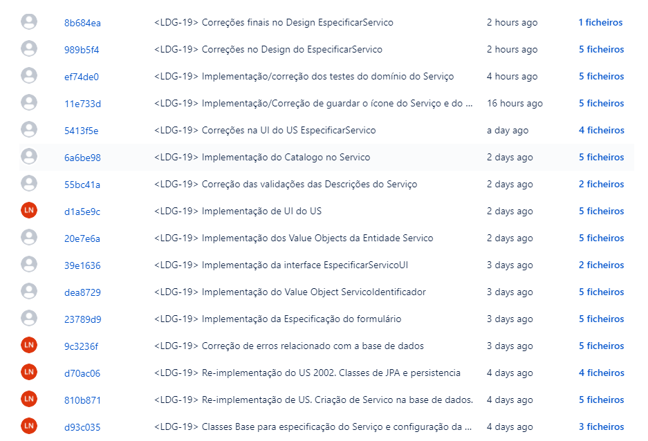

Especificar Serviço
=======================================

# 1. Requisitos

**Especificar Serviço** Como Gestor de Serviços de Help Desk (GSH), eu pretendo proceder à especificação de um novo serviço.

- Especificar Serviço 1.1. Como Gestor de Serviços de Help Desk (GSH), pretendo ter a possibilidade de retomar a um serviço que esteja incompleto. 

A interpretação feita deste requisito foi no sentido de viabilizar a especificação de serviços com vista a resolver o problema especificado pelo Gestor de Serviços do Help Desk (GSH).

# 2. Análise

- A especificação do serviço requer não só a informação base nele contida, tal como outros dados/informação a recolher relativamente ao formulário. Cada formulário será associado a um serviço.
- A atividade de aprovação do serviço especificado, podendo ser requerida ou não. 
- A atividade de realização também é referente ao serviço, podendo esta ser manual ou automática. 
- Uma atividade manual terá um formulário associado, enquanto que uma tarefa automática tem associado um script.
- Tendo em conta a extensão e complexidade na especificação de um serviço, esta pode ser feita em diferentes momentos espaçados no tempo, de modo a permitir que este fique incompleto para ser, posteriormente, continuada/completada.

# 3. Design

## 3.1. Realização da Funcionalidade

## Diagrama de Sequência ##

Temos, como diagrama de sequência para a especificação do serviço, onde o ator, como Gestor de Serviços de Help Desk (GSH), dá início a uma especificação de serviço, o sistema solicita os dados necessários sobre o serviço(título, descBreve, descCompleta, icone, conjKWs, feedback), tal como a sua atividade de aprovação e atividade de realização, o sistema apresenta todos os catálogos e o GSH introduz os dados solicitados escolhe um Catálogo. Por fim, de forma opcional, dados sobre o formulário (nome) com a respetiva lista de atributos a solicitar(nomeVar, label, descAjuda, tipoDBas, expRegular). O GSH introduz os dados solicitados, o sistema valida os dados e informa do sucesso da operação.

### Especificar Serviço ###

### Especificar Formulário ###

Na especificação de um novo serviço, o sistema pede os dados necessários e apresenta todos os Catálogos onde o Serviço se pode inserir. Após o GSH introduzir todos os dados e selecionar o Catálogo, o sistema pede os dados do Formulário, onde o GSH pode:

- Especificar um formulário (nome) e um conjunto de atributos associados(nomeVar, label, descAjuda, tipoDBas, expRegular), promovendo o Serviço a um estado "completo".
- Pode não querer criar um formulário, resultando na especificação de um Serviço no estado "incompleto".

## 3.2. Diagrama de Classes

//TODO
*Nesta secção deve apresentar e descrever as principais classes envolvidas na realização da funcionalidade.*

## 3.3. Padrões Aplicados

* DDD - Domain Driven Design.
  >A elaboração do projeto começou logo com DDD em mente. O modelo de domínio foi elaborado com as regras de negócio e o overlay do DDD para representação de agregados, entities e roots seguindo as regras necessárias.

* GRASP
  >Com cada representação de um ator ou user story, o GRASP era sempre tido em consideração, visto ser uma base fundamental para o bom desenvolvimento do projeto.
  > Quer seja o Information Expert, Low coupling/High cohesion ou o conceito de controller, todos estes princípios estão bastante presentes na mente dos elementos do grupo.

* SOLID
  > O SOLID esteve present principalmente com o Single Responsability Principle, sendo que foi sempre tido em atenção as responsabilidades que uma classe deve ter.
  >Já implementado com o projeto base de EAPLI, a Interface Seggregation Principle veio-se provar útil e esclarecedora, tendo em conta os diversos repositórios que tiveram que ser criados.

## 3.4. Testes 
*Nesta secção deve sistematizar como os testes foram concebidos para permitir uma correta aferição da satisfação dos requisitos.*

**testMesmoIdentificadorServicoEquals:** Verificar se dois Serviços são iguais

    public void testMesmoIdentificadorServicoEquals(){

        final Servico servico1 = new ServiceBuilder().comIdentificador("identificador").comTitulo("teste").comDescBreve("teste").comDescComp("teste").build();

        final Servico servico2 = new ServiceBuilder().comIdentificador("identificador").comTitulo("teste").comDescBreve("teste").comDescComp("teste").build();

        final boolean expected = servico1.identity().equals(servico2.identity());

        assertTrue(expected);
    }

**testMesmoIdentificadorServicoEquals:** Verificar se dois Serviços são diferentes

    public void testDiferentesIdentificadorServicoEquals() {

        final Servico servico1 = new ServiceBuilder().comIdentificador("falso").comTitulo("teste").comDescBreve("teste").comDescComp("teste").build();

        final Servico servico2 = new ServiceBuilder().comIdentificador("verdadeiro").comTitulo("teste").comDescBreve("teste").comDescComp("teste").build();

        final boolean expected = servico1.equals(servico2);

        assertFalse(expected);
    }

# 4. Implementação

**especificarServico:** Especifica um novo Serviço

    public Servico especificarServico(String identificador, String titulo, String descBreve, String descCompleta,
                                      int icon, boolean atAprov, boolean atReal, Set<Keyword> keywords, String estado, boolean requerFeed, Catalogo catalogo) {

        ServiceBuilder serviceBuilder = new ServiceBuilder();
        serviceBuilder.comIdentificador(identificador).comTitulo(titulo).comDescBreve(descBreve).comDescComp(descCompleta)
                      .comIcon(new byte[icon]).comAtAprov(atAprov)
                      .comAtReal(atReal).comKeywords(keywords).comEstado(estado).comCatalogo(catalogo).comRequerFeedback(requerFeed);

       return this.repoServ.save(serviceBuilder.build());
    }

**especificarFormulario:** Especifica um novo Formulário

    public Formulario especificarFormulario(NomeFormulario nome, Servico servico){

        FormularioBuilder formularioBuilder = new FormularioBuilder();
        formularioBuilder.comNome(nome).comServico(servico).comConjAtributos(this.conjAtrib);

        return repoForm.save(formularioBuilder.build());
    }

## 4.1 Commits Relevantes

