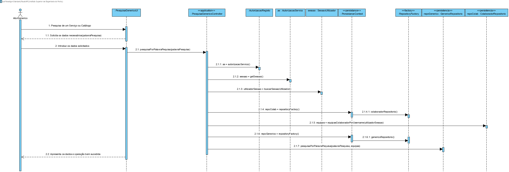
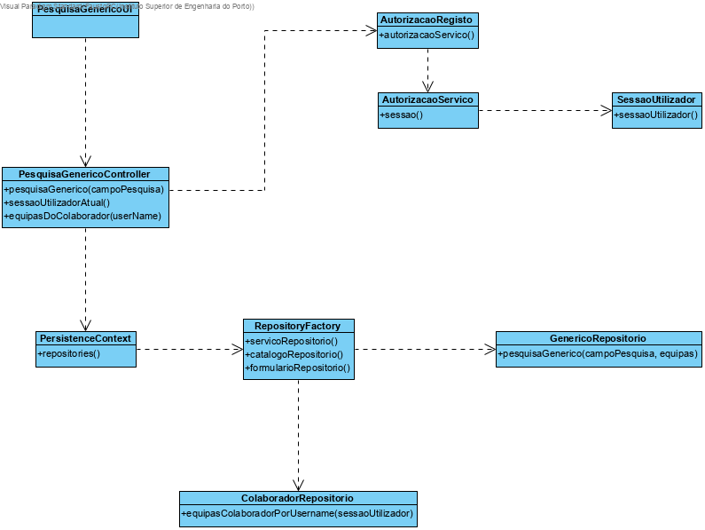
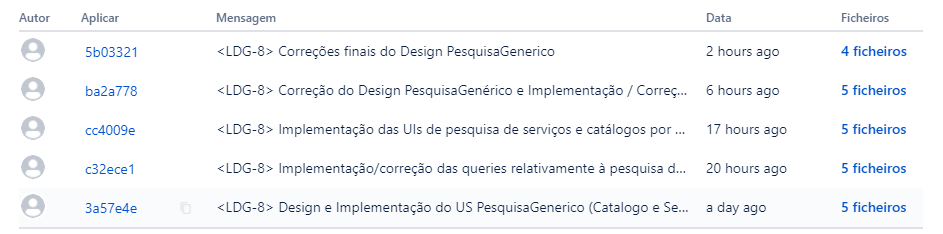

Pesquisar Genérico
=======================================

# 1. Requisitos

**Pesquisar Genérico** Como utilizador, eu pretendo consultar/pesquisar os catálogos de serviços e respetivos serviços que me estão/são disponibilizados.

A interpretação feita deste requisito foi no sentido de viabilizar a pesquisa de serviços e/ou catálogos de modo a que o utilizador possa conhecer os seus serviços/catálogos existentes.

# 2. Análise

- A consulta/pesquisa dos catálogos de serviços e respetivos serviços. Apenas devem ser apresentados os que estão/são disponibilizados ao utilizador em causa, isto é, as equipas em que o utilizador se insere .
- A pesquisa deve ser orientada pelas palavras-chave dos serviços e/ou pelos respetivos títulos e os resultados agrupados pelos respetivos catálogos.
- Deve permitir consultar detalhes de cada um dos resultados da pesquisa;
- Os serviços cuja especificação esteja incompleta podem aparecer sinalizados com a informação "brevemente disponível".
- Deve permitir pesquisar por vários campos/informações.

# 3. Design

## 3.1. Realização da Funcionalidade

## Diagrama de Sequência ##

Temos, como diagrama de sequência para a pesquisa genérica de um serviço/catálogo por vários campos, onde o ator, como Utilizador, dá início a uma pesquisa de um servico ou catálogo por determinado campo, o sistema solicita o campo que deseja pesquisar, o utilizador introduz os dados solicitados e o sistema apresenta a lista de serviços/catálogos e informa o sucesso da operação.

### Especificar Serviço ###

## 3.2. Diagrama de Classes

## 3.3. Padrões Aplicados

* DDD - Domain Driven Design.
  >A elaboração do projeto começou logo com DDD em mente. O modelo de domínio foi elaborado com as regras de negócio e o overlay do DDD para representação de agregados, entities e roots seguindo as regras necessárias.

* GRASP
  >Com cada representação de um ator ou user story, o GRASP era sempre tido em consideração, visto ser uma base fundamental para o bom desenvolvimento do projeto.
  > Quer seja o Information Expert, Low coupling/High cohesion ou o conceito de controller, todos estes princípios estão bastante presentes na mente dos elementos do grupo.

* SOLID
  > O SOLID esteve present principalmente com o Single Responsability Principle, sendo que foi sempre tido em atenção as responsabilidades que uma classe deve ter.
  >Já implementado com o projeto base de EAPLI, a Interface Seggregation Principle veio-se provar útil e esclarecedora, tendo em conta os diversos repositórios que tiveram que ser criados.

## 3.4. Testes 

**testValueOfServico** Verifica se o identificador de dois Serviços são iguais.

    public void testValueOf() {
        ServicoIdentificador servicoIdentificador = getDummyServicoIdentificador();
        ServicoIdentificador valueOf = ServicoIdentificador.valueOf("teste");

        final boolean expected = servicoIdentificador.equals(valueOf);

        assertTrue(expected);
    }

# 4. Implementação

**pesquisarCatalogoPorTitulo** Pesquisar um Catálogo acessível pelo utilizador através do seu título.

    public Iterable<Catalogo> pesquisarCatalogoPorTitulo(final String titulo){
        return repoCat.catalogoPorTitulo(titulo);
    }

**pesquisarCatalogoPorTitulo** Pesquisar um Serviço acessível pelo utilizador através do seu identificador único.

    public List<Servico> pesquisarServicoPorIdentificador(final String identificador, final Catalogo catalogo){
        return repoServ.servicoPorIdentificador(identificador, catalogo);
    }

## 4.1 Commits Relevantes

