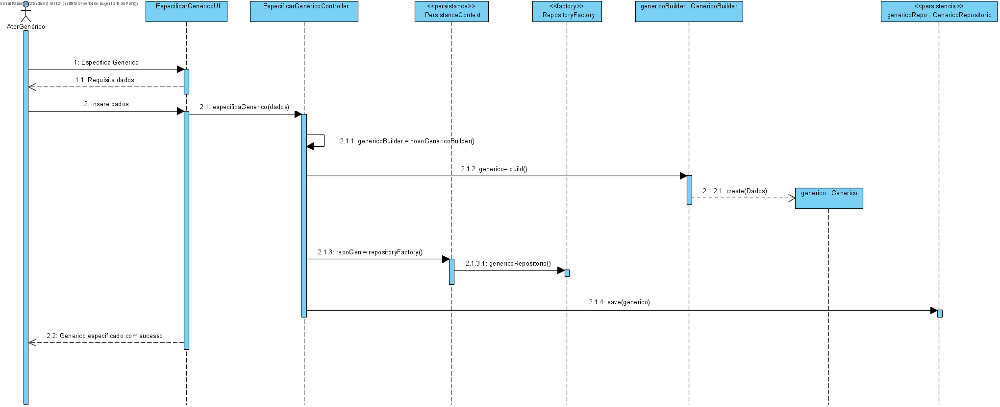
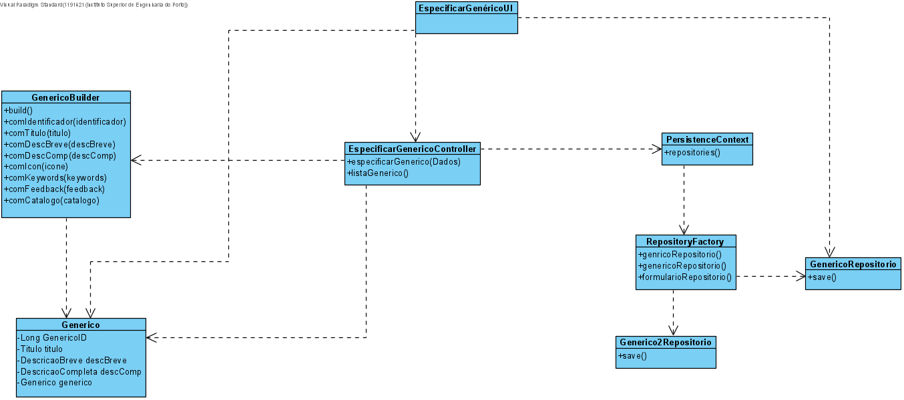

 Especificar Nível de Criticidade
=======================================

# 1. Requisitos

**US 2010** Como Gestor de Serviços do Helpdesk pretendo definir os niveis de criticidade e respetivos objetivos aplicados na organização para definição de SLAs.

A interpretação feita deste requisito foi no sentido de um nível de criticidade ser constituído por diversos parametros (etiqueta, nivel, objetivos, etc) que irão servir para ajudar a qualificar a execução de um serviço.
Mediante os níveis de criticidade e SLAs conseguimos medir a performance dos colaboradores e atribuir prioriades mais facilmente.

# 2. Análise

- A especificação de um nível de criticidade requer certos parâmetros, alguns dos quais com as suas próprias regras de negócio.
- Etiqueta - Um identificador do nivel em si
- Valor de Escala - Este valor está contido entre 1 e 4, sendo 4 o nivel mais alto, e, portanto, o mais prioritário e urgente.
- Cor - Cor identificadora do nível, a ideia é que a cor seja tanto mais vermelha quanto o Valor de Escala for maior.
- Objetivo - O objetivo do nível entra para que seja possível medir a performance e tornar claro a urgência de alguns serviços. Este contém o tempo máximo que um colaborador pode demorar a aceitar o serviço e o tempo máximo que o mesmo pode demorar na sua execução.

# 3. Design

## 3.1. Realização da Funcionalidade

A implementação da funcionalidade em causa consiste na inserção simples dos dados requeridos na consola, o seu sucesso significa que o nível de criticidade ficou registado na base de dados.

## Diagrama de Sequência ##

Foi criado um SD genérico para representar aqueles que o grupo considerava USs de criação simples, e que não justificavam a criação diferenciada de diagramas sendo que eram bastante similares.

O GSH inicia uma nova especificação de um nivel de criticidade, o sistema requisita os dados necessários (Etiqueta, nivel, cor, objetivos) e procede à sua criação. Após criação do nível de criticidade na unidade de persistência, o GSH é informado da sua criação.

## 3.2. Diagrama de Classes

Foi criado um CD genérico para representar aqueles que o grupo considerava USs de criação simples, e que não justificavam a criação diferenciada de diagramas sendo que eram bastante similares.

## 3.3. Padrões Aplicados

* DDD - Domain Driven Design. 
    >A elaboração do projeto começou logo com DDD em mente. O modelo de domínio foi elaborado com as regras de negócio e o overlay do DDD para representação de agregados, entities e roots seguindo as regras necessárias.

* GRASP
  >Com cada representação de um ator ou user story, o GRASP era sempre tido em consideração, visto ser uma base fundamental para o bom desenvolvimento do projeto.
  > Quer seja o Information Expert, Low coupling/High cohesion ou o conceito de controller, todos estes princípios estão bastante presentes na mente dos elementos do grupo.
  
* SOLID
    > O SOLID esteve present principalmente com o Single Responsability Principle, sendo que foi sempre tido em atenção as responsabilidades que uma classe deve ter.
    >Já implementado com o projeto base de EAPLI, a Interface Seggregation Principle veio-se provar útil e esclarecedora, tendo em conta os diversos repositórios que tiveram que ser criados.
## 3.4. Testes 
*Nesta secção deve sistematizar como os testes foram concebidos para permitir uma correta aferição da satisfação dos requisitos.*

**Teste 1:** Verificar que não é possível criar uma instância da classe Exemplo com valores nulos.

	@Test(expected = IllegalArgumentException.class)
		public void ensureNullIsNotAllowed() {
		Exemplo instance = new Exemplo(null, null);
	}

# 4. Implementação

Sendo este um US mais simples, a sua implementação foi facilmente submetida num único commit. 

# 5. Integração/Demonstração

* A integração da funcionalidade com o sistema foi bastante facilitada pelo projeto base de EAPLI, visto que, após ter uma boa compreensão de como este funciona, um membro da equipa consegue levar a cabo a criação de uma entidade com os seus respetivos atributos fácil e rapidamente. 
Quer seja com a persistência na base de dados ou a facilidade de observar as diversas camadas de negócio divididas por módulos.
# 6. Observações

*Nesta secção sugere-se que a equipa apresente uma perspetiva critica sobre o trabalho desenvolvido apontando, por exemplo, outras alternativas e ou trabalhos futuros relacionados.*

