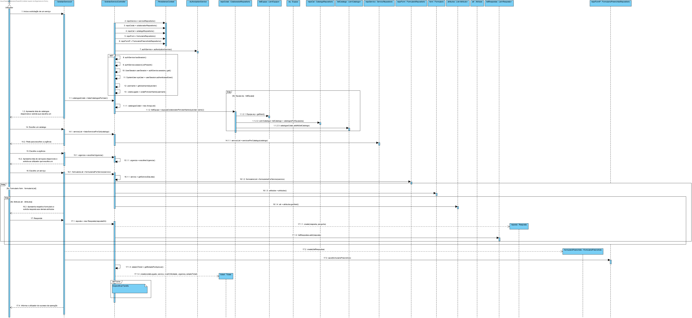
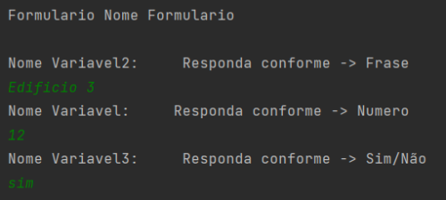

 Solicitar Serviço
=======================================

# 1. Requisitos

**US 3002** Como utilizador, eu pretendo solicitar um serviço do catálogo de serviços que me é disponibilizado.

A interpretação feita deste requisito consistiu na perceção de que este User Story é dos mais importantes de toda a aplicação. Para ser concretizado, um utilizador autenticado, após lhe serem apresentados os catálogos a ele disponibilizados, escolhe um e subsequentemente um dos serviços associado ao mesmo.
Após escolher o serviço desejado, tem agora de preencher os formulários a este associado.
# 2. Análise

- A solicitação de um serviço acaba por ser um dos User stories mais importantes do sistema.
  > O utilizador só tem acesso aos catalogos previamente assignados a este.

  > A solicitação do mesmo requer o preenchimento dos formuçários a este associado.
  
  > Se tudo correr conforme as normas, o pedido deverá ser processado.

# 3. Design

## 3.1. Realização da Funcionalidade

A implementação da funcionalidade em causa consiste na seleção por parte do utilizador de um catálogo, dos vários que lhe são apresentados,
após escolher o catalogo, escolhe um dos serviços contidos neste e tendo escolhido o serviço, preenche os respetivos formulários, concluindo assim o US.

## Diagrama de Sequência ##

O Utilizador inicia uma nova solicitação de serviço. O sistema apresenta os catálogos disponíveis para o utilizador.O utilizador escolhe um. 
O sistema apresenta os serviços disponíveis no catalgo escolhido. O utilizador escolhe um serviço. O sistema apresenta os respetivos formulários e pede ao utilizador que os preencha. O utilizador preenche. O pedido é processado.

## 3.2. Diagrama de Classes

## 3.3. Padrões Aplicados

* DDD - Domain Driven Design. 
    >A elaboração do projeto começou logo com DDD em mente. O modelo de domínio foi elaborado com as regras de negócio e o overlay do DDD para representação de agregados, entities e roots seguindo as regras necessárias.

* GRASP
  >Com cada representação de um ator ou user story, o GRASP era sempre tido em consideração, visto ser uma base fundamental para o bom desenvolvimento do projeto.
  > Quer seja o Information Expert, Low coupling/High cohesion ou o conceito de controller, todos estes princípios estão bastante presentes na mente dos elementos do grupo.
  
* SOLID
    > O SOLID esteve present principalmente com o Single Responsability Principle, sendo que foi sempre tido em atenção as responsabilidades que uma classe deve ter.
    >Já implementado com o projeto base de EAPLI, a Interface Seggregation Principle veio-se provar útil e esclarecedora, tendo em conta os diversos repositórios que tiveram que ser criados.
## 3.4. Testes 
*Nesta secção deve sistematizar como os testes foram concebidos para permitir uma correta aferição da satisfação dos requisitos.*

**Teste 1:** Verificar que não é possível criar uma instância da classe Exemplo com valores nulos.

	@Test(expected = IllegalArgumentException.class)
		public void ensureNullIsNotAllowed() {
		Exemplo instance = new Exemplo(null, null);
	}

# 4. Implementação

- Abaixo estão alguns commits relevantes para demonstrar a implementação gradual e com controlo de versões que foi levada a cabo

# 5. Integração/Demonstração

- A integração levada a cabo foi trabalhosa, principalmente devido ao facto de à medida que se ia implementando certas funcionalidades nos apercebermos de certos conceitos de negócio que teriam ficado esquecidos.

- Abaixo encotramos alguns screenshots elucidativos do principio basico de funcionamento da US  

  
  
  
# 6. Observações

*Nesta secção sugere-se que a equipa apresente uma perspetiva critica sobre o trabalho desenvolvido apontando, por exemplo, outras alternativas e ou trabalhos futuros relacionados.*

