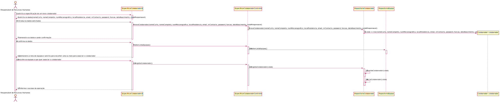
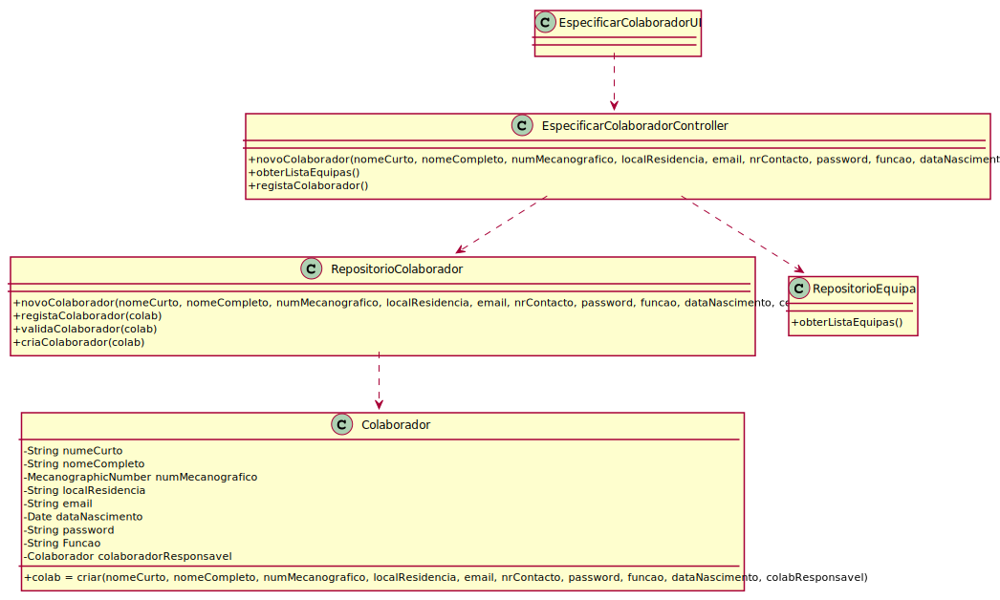

# Especificar Colaborador
=======================================

# 1. Requisitos

**US 2051**

*Como Responsável de Recursos Humanos (RRH), eu pretendo proceder à especificação de um novo colaborador de modo a que 
este possa, posteriormente, aceder e usar o sistema.*

A interpretação feita deste requisito foi no sentido tornar possível para o Responsável de Recursos Humanos (RRH) poder 
criar um colaborador sendo também necessário haver a possibilidade de o adicionar a uma ou mais equipa, que não pertençam
ao mesmo tipo.

# 2. Análise

- A especificação de um colaborador requer certos parâmetros, alguns dos quais com as suas próprias regras de negócio.
- Nome curto: o nome do colaborador, sendo normalmente o primeiro e o último
  que não excedesse os 30 carateres.
- Nome completo: o nome completo do colaborador que não excedesse os 80 carateres.
- Morada: constituída pelo Distrito e Concelho do colaborador.
- Função: cada colaborador deve ter uma função bem definida para a empresa.
- Nr contacto: o nr de contacto deve ser um número de apenas 9 dígitos.
- Colaborador responsável: aquando da criação do colaborador deve lhe ser atribuído um colaborador 
responsável.

# 3. Design
## 3.1. Realização da Funcionalidade

A implementação desta funcionalidade em causa consiste na criação de um novo colaborador através da
inserção dos dados requeridos na consola. A mensagem de sucesso confirma a criação e o registo do
mesmo na base de dados.

## 3.3. Diagrama de Sequência

Dado a especificidade da criação de um colaborador optei por criar um SD próprio, além do SD genérico criado pela equipa
de modo a melhor traduzir da melhor forma o que era necessário implementar.

O RRH inicia por solicitar a especificação de um novo colaborador. O sistema pede os respetivos dados para a criação do 
colaborador, que depois de respondido, o sistema procede à criação do mesmo. Depois disso, sendo portanto opcional, o
sistema apresenta a lista de equipas a que o colaborador pode ser adicionado. O RRH esolhe as equipas a que deseja que o
colaborador seja adicionado e o colaborador é finalmente criado e por consequência adicionado à base de dados. Por último
se tudo tiver sido corretamente atríbuido, o sistema informa o sucesso da operação.

## 3.3. Diagrama de Classes

O diagrama de classes representa a estrutura do sistema ao modelar as classes, atributos, operações e relações entre 
objetos. 

## 3.4. Padrões Aplicados

* DDD - Domain Driven Design.
  >A elaboração do projeto começou logo com DDD em mente. O modelo de domínio foi elaborado com as regras de negócio e o overlay do DDD para representação de agregados, entities e roots seguindo as regras necessárias.

* GRASP
  >Com cada representação de um ator ou user story, o GRASP era sempre tido em consideração, visto ser uma base fundamental para o bom desenvolvimento do projeto.
  > Quer seja o Information Expert, Low coupling/High cohesion ou o conceito de controller, todos estes princípios estão bastante presentes na mente dos elementos do grupo.

* SOLID
  > O SOLID esteve present principalmente com o Single Responsability Principle, sendo que foi sempre tido em atenção as responsabilidades que uma classe deve ter.
  >Já implementado com o projeto base de EAPLI, a Interface Seggregation Principle veio-se provar útil e esclarecedora, tendo em conta os diversos repositórios que tiveram que ser criados.

# 4. Implementação

A implementação deste US encontra-se subdividido entre muitos commits dado que fomos encontrando à medida que fomos
implementando, novas regras de negócio que não tinhamos conhecimento, além disso, algumas resoluções de bugs que se encontravam
no código.

# 5. Integração/Demonstração

A integração da funcionalidade com o sistema foi mais facilitada pelo projeto base de EAPLI, visto que, depois de ter 
o conhecimento do projeto, o trabalho encontra-se muitas vezes simplificado com esta framework.
Quer seja com a persistência na base de dados ou a facilidade de observar as diversas camadas de negócio divididas 
por módulos.

# 6. Observações

O trabalho desenvolvido neste US foi de forma geral bem feito, com a entreajuda de todos os membros do grupo foi 
facilitada o desenvolvimento do mesmo.

